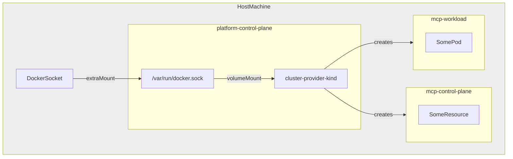

[](https://api.reuse.software/info/github.com/openmcp-project/cluster-provider-kind)

# Cluster Provider kind

## About this project

A cluster provider for OpenMCP that uses [kind](https://kind.sigs.k8s.io/) to provision clusters. Ideal for local development and E2E tests.

## Requirements and Setup

In combination with the [openMCP Operator](https://github.com/openmcp-project/openmcp-operator), this operator can be deployed via a simple k8s resource:
```yaml
apiVersion: openmcp.cloud/v1alpha1
kind: ClusterProvider
metadata:
  name: kind
spec:
  image: "ghcr.io/openmcp-project/images/cluster-provider-kind:<latest-version>"
```

To run it locally, run
```shell
go run ./cmd/cluster-provider-kind/main.go init
```
to deploy the CRDs that are required for the operator and then
```shell
go run ./cmd/cluster-provider-kind/main.go run
```

## How it works

In order to create new kind clusters from within a kind cluster, the Docker socket (usually `/var/run/docker.sock`) needs to be available to the `cluster-provider-kind` pod. As a prerequisite, the Docker socket of the host machine must be mounted into the nodes of the platform kind cluster. In this case, there is only a single node (`platform-control-plane`). The socket can then be mounted by the cluster-provider-kind pod using a `hostPath` volume.



The kind configuration for the platform cluster may look like this:

```yaml
apiVersion: kind.x-k8s.io/v1alpha4
kind: Cluster
nodes:
- role: control-plane
  extraMounts:
  - hostPath: /var/run/docker.sock
    containerPath: /var/run/host-docker.sock
```
 In order to test that the socket is functional, a simple pod can be deployed:

```yaml
apiVersion: v1
kind: Pod
metadata:
  name: ubuntu
spec:
  containers:
  - image: ubuntu
    name: ubuntu
    volumeMounts:
      - mountPath: /var/run/docker.sock
        name: docker
    command:
      - sleep
      - "3600"
  volumes:
    - name: docker
      hostPath:
        path: /var/run/host-docker.sock
        type: Socket
```

After installing docker CLI and kind, it should be possible to create a new kind cluster on the level of the host machine: `kind create cluster --name test`

```
$ kind create cluster --name test

Creating cluster "test" ...
 ✓ Ensuring node image (kindest/node:v1.31.0) 🖼
 ✓ Preparing nodes 📦
 ✓ Writing configuration 📜
 ✓ Starting control-plane 🕹️
 ✓ Installing CNI 🔌
 ✓ Installing StorageClass 💾
Set kubectl context to "kind-test"
You can now use your cluster with:

kubectl cluster-info --context kind-test

Thanks for using kind! 😊
```

This can be verified by running `kind get clusters` directly on the host machine:

```
$ kind get clusters

platform
test
```

## Support, Feedback, Contributing

This project is open to feature requests/suggestions, bug reports etc. via [GitHub issues](https://github.com/openmcp-project/cluster-provider-kind/issues). Contribution and feedback are encouraged and always welcome. For more information about how to contribute, the project structure, as well as additional contribution information, see our [Contribution Guidelines](CONTRIBUTING.md).

## Security / Disclosure
If you find any bug that may be a security problem, please follow our instructions at [in our security policy](https://github.com/openmcp-project/cluster-provider-kind/security/policy) on how to report it. Please do not create GitHub issues for security-related doubts or problems.

## Code of Conduct

We as members, contributors, and leaders pledge to make participation in our community a harassment-free experience for everyone. By participating in this project, you agree to abide by its [Code of Conduct](https://github.com/SAP/.github/blob/main/CODE_OF_CONDUCT.md) at all times.

## Licensing

Copyright 2025 SAP SE or an SAP affiliate company and cluster-provider-kind contributors. Please see our [LICENSE](LICENSE) for copyright and license information. Detailed information including third-party components and their licensing/copyright information is available [via the REUSE tool](https://api.reuse.software/info/github.com/openmcp-project/cluster-provider-kind).
