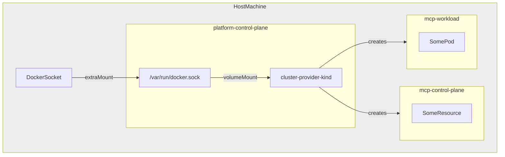

[](https://api.reuse.software/info/github.com/openmcp-project/cluster-provider-kind)

# Cluster Provider kind

## About this project

A cluster provider for [OpenMCP](https://github.com/openmcp-project/openmcp-operator) that uses [kind](https://kind.sigs.k8s.io/) (Kubernetes IN Docker) to provision and manage Kubernetes clusters. This provider enables you to create and manage multiple Kubernetes clusters running as Docker containers, making it ideal for:

- **Local Development**: Quickly spin up multiple clusters for testing multi-cluster scenarios
- **E2E Testing**: Automated testing of multi-cluster applications and operators
- **CI/CD Pipelines**: Lightweight cluster provisioning for testing environments

## 🧪 Prerequisites

Before using this cluster provider, ensure you have:

- **Docker**: Running Docker daemon with socket accessible
- **kind**: [kind CLI tool](https://kind.sigs.k8s.io/docs/user/quick-start/) installed
- **kubectl**: For interacting with Kubernetes clusters

## 🏗️ Installation

### Local Development

To run the cluster-provider-kind on your local machine, you need to first bootstrap an openMCP environment by using [openmcp-operator](https://github.com/openmcp-project/openmcp-operator). A comprehensive guide will follow soon.

In order to run the cluster-provider-kind properly, it is necessary to configure the openMCP Platform cluster with the Docker socket mounted into the nodes. Please use the following kind cluster configuration:
```yaml
apiVersion: kind.x-k8s.io/v1alpha4
kind: Cluster
nodes:
- role: control-plane
  extraMounts:
  - hostPath: /var/run/docker.sock
    containerPath: /var/run/host-docker.sock
```

You can create the Platform cluster using the above configuration by running:

```shell
kind create cluster --name platform --config ./path/to/config
kubectl config use-context kind-platform
```

For current testing reasons, it is recommended to test and run the cluster-provider-kind in the cluster. To run the latest version of your changes in your local environment, you need to run:

```bash
task build:img:build
```

This will build the image of the cluster-provider-kind and push it to your local Docker registry.

```bash
docker images ghcr.io/openmcp-project/images/cluster-provider-kind
```

You can then apply the `ClusterProvider` resource to your openMCP Platform cluster:

```yaml
apiVersion: openmcp.cloud/v1alpha1
kind: ClusterProvider
metadata:
  name: kind
spec:
  image: ghcr.io/openmcp-project/images/cluster-provider-kind:... # latest local docker image build
  extraVolumeMounts:
    - mountPath: /var/run/docker.sock
      name: docker
  extraVolumes:
    - name: docker
      hostPath:
        path: /var/run/host-docker.sock
        type: Socket
```

### Running Cluster Provider kind outside the cluster (not recommended)
You can also run the cluster-provider-kind outside the cluster, but this is not recommended at the moment, since the operator might not work as expected due to some IP address issues with your Docker network access.

The following steps will help you to run the cluster-provider-kind outside the cluster:
1. Initialize the CRDs:
```bash
go run ./cmd/cluster-provider-kind/main.go init
```

2. Run the operator:
```bash
KIND_ON_LOCAL_HOST=true go run ./cmd/cluster-provider-kind/main.go run
```

> **Note**: When running the operator outside the cluster (locally), you must set the `KIND_ON_LOCAL_HOST` environment variable to `true`. This tells the operator to use the local Docker socket configuration instead of the in-cluster configuration.

## 📖 Usage

### Creating a `Cluster` via `ClusterRequest`

Create a new kind cluster by applying a `ClusterRequest` resource:

```yaml
apiVersion: clusters.openmcp.cloud/v1alpha1
kind: ClusterRequest
metadata:
  name: mcp
  namespace: default
spec:
  purpose: mcp
```

```shell
kubectl apply -f clusterrequest.yaml
```

## 🧑‍💻 Development

### Building the binary locally

To build the binary locally, you can use the following command:

```bash
task build
```

### Build the image locally

To build the image locally, you can use the following command:

```bash
task build:img:build
```

### Run unit tests locally

To run the unit tests locally, you can use the following command:

```bash
task test
```

### Generating the CRDs, DeepCopy functions etc.
To generate the CRDs, DeepCopy functions, and other boilerplate code, you can use the following command:

```bash
task generate
```

## 🏋️ How it works

### Docker Socket Access

In order to create new kind clusters from within a kind cluster, the Docker socket (usually `/var/run/docker.sock`) needs to be available to the `cluster-provider-kind` pod. As a prerequisite, the Docker socket of the host machine must be mounted into the nodes of the platform kind cluster. In this case, there is only a single node (`platform-control-plane`). The socket can then be mounted by the cluster-provider-kind pod using a `hostPath` volume.



### Platform Cluster Configuration

The kind configuration for the platform cluster may look like this:

```yaml
apiVersion: kind.x-k8s.io/v1alpha4
kind: Cluster
nodes:
- role: control-plane
  extraMounts:
  - hostPath: /var/run/docker.sock
    containerPath: /var/run/host-docker.sock
```

### Testing Docker Socket Access

In order to test that the socket is functional, a simple pod can be deployed:

```yaml
apiVersion: v1
kind: Pod
metadata:
  name: ubuntu
spec:
  containers:
  - image: ubuntu
    name: ubuntu
    volumeMounts:
      - mountPath: /var/run/docker.sock
        name: docker
    command:
      - sleep
      - "3600"
  volumes:
    - name: docker
      hostPath:
        path: /var/run/host-docker.sock
        type: Socket
```

After installing docker CLI and kind, it should be possible to create a new kind cluster on the level of the host machine: `kind create cluster --name test`

```
$ kind create cluster --name test

Creating cluster "test" ...
 ✓ Ensuring node image (kindest/node:v1.31.0) 🖼
 ✓ Preparing nodes 📦
 ✓ Writing configuration 📜
 ✓ Starting control-plane 🕹️
 ✓ Installing CNI 🔌
 ✓ Installing StorageClass 💾
Set kubectl context to "kind-test"
You can now use your cluster with:

kubectl cluster-info --context kind-test

Thanks for using kind! 😊
```

This can be verified by running `kind get clusters` directly on the host machine:

```
$ kind get clusters

platform
test
```

## ❤️ Support, Feedback, Contributing

This project is open to feature requests/suggestions, bug reports etc. via [GitHub issues](https://github.com/openmcp-project/cluster-provider-kind/issues). Contribution and feedback are encouraged and always welcome. For more information about how to contribute, the project structure, as well as additional contribution information, see our [Contribution Guidelines](CONTRIBUTING.md).

## 🔐 Security / Disclosure

If you find any bug that may be a security problem, please follow our instructions at [in our security policy](https://github.com/openmcp-project/cluster-provider-kind/security/policy) on how to report it. Please do not create GitHub issues for security-related doubts or problems.

## 🤝 Code of Conduct

We as members, contributors, and leaders pledge to make participation in our community a harassment-free experience for everyone. By participating in this project, you agree to abide by its [Code of Conduct](https://github.com/SAP/.github/blob/main/CODE_OF_CONDUCT.md) at all times.

## 📋 Licensing

Copyright 2025 SAP SE or an SAP affiliate company and cluster-provider-kind contributors. Please see our [LICENSE](LICENSE) for copyright and license information. Detailed information including third-party components and their licensing/copyright information is available [via the REUSE tool](https://api.reuse.software/info/github.com/openmcp-project/cluster-provider-kind).
